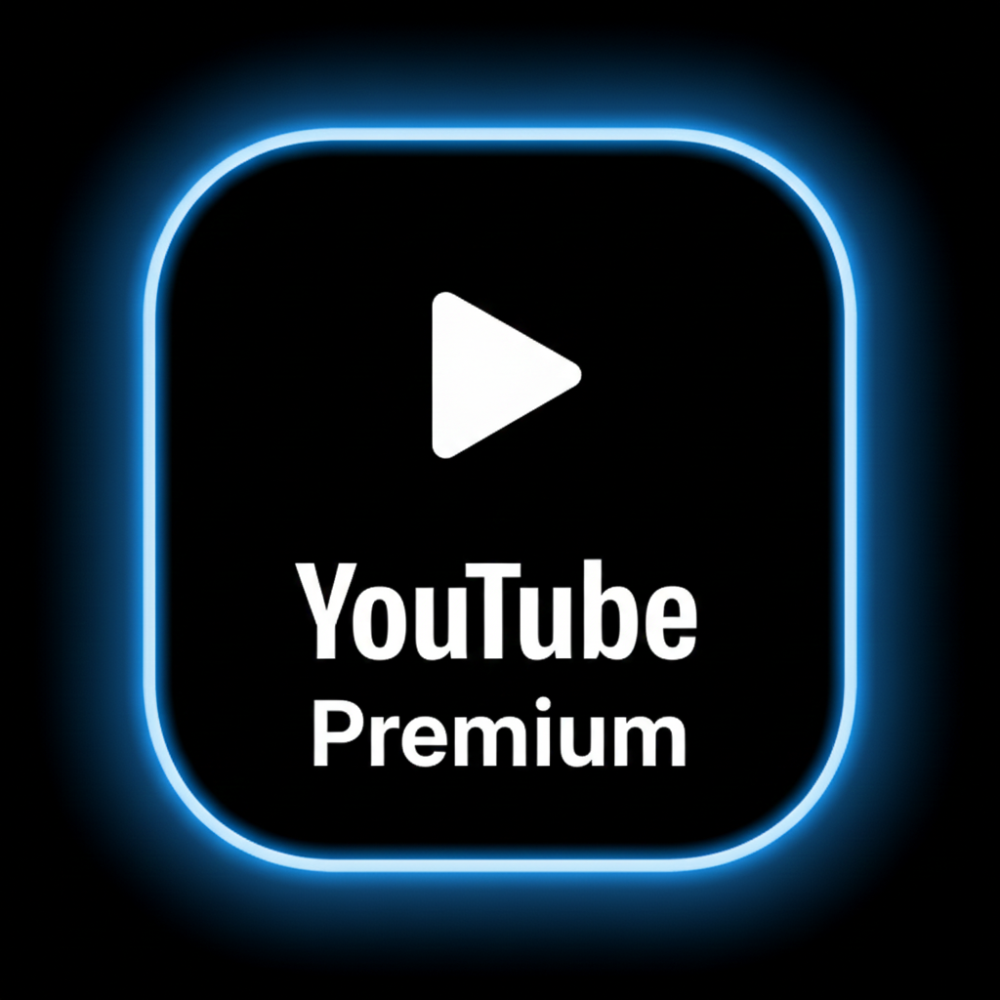
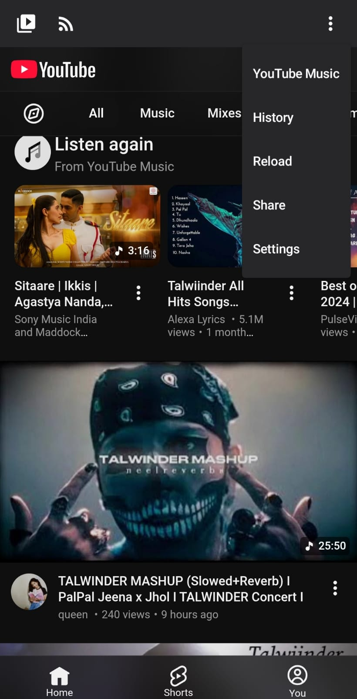
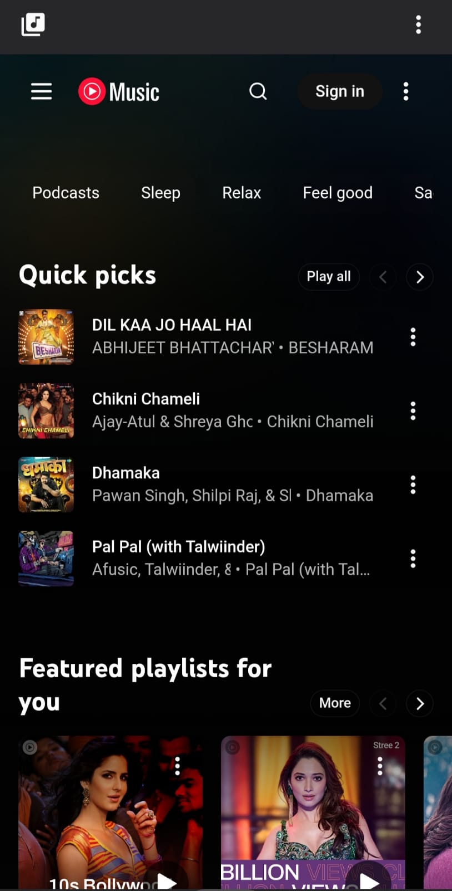

  

<h1 align="center">Premium YouTube</h1>

  <b>An enhanced version of NouTube</b> 
  Ad-free video playback • Background play • YouTube Music Support  
    
  
  
  

---

## 📌 Overview
**Premium YouTube** is a rebranded & modified build of the open-source **NouTube** project.  
The goal is to provide a premium-like YouTube experience without ads and with background playback.  
This project also includes **YouTube Music** support integrated in a single app.

> 🛠 Modified & maintained by **FirewallClub Members**  
> 🔗 Credits to original source: https://github.com/nonbili/NouTube

---

## ✨ Features

| Feature | Status |
|--------|--------|
| 🚫 No Ads in Video Playback | ✔ Enabled |
| ▶ Background Play | ✔ Enabled |
| 🎵 YouTube Music Supported | ✔ Included |
| 🎨 Rebranded UI/Icon/Splash | ✔ Customized |
| 📱 Smooth Performance | ✔ Optimized |
**No login required — use freely without signing in**
---

## 📥 Download

You can directly download the latest build from the link below:

 

---

## 📸 Screenshots

  
  

### ⚠ Legal Notice
- This repository is for educational and personal research purposes only.
- All rights and original ownership belong to their respective creators.
- Commercial redistribution of modified APKs is discouraged.
